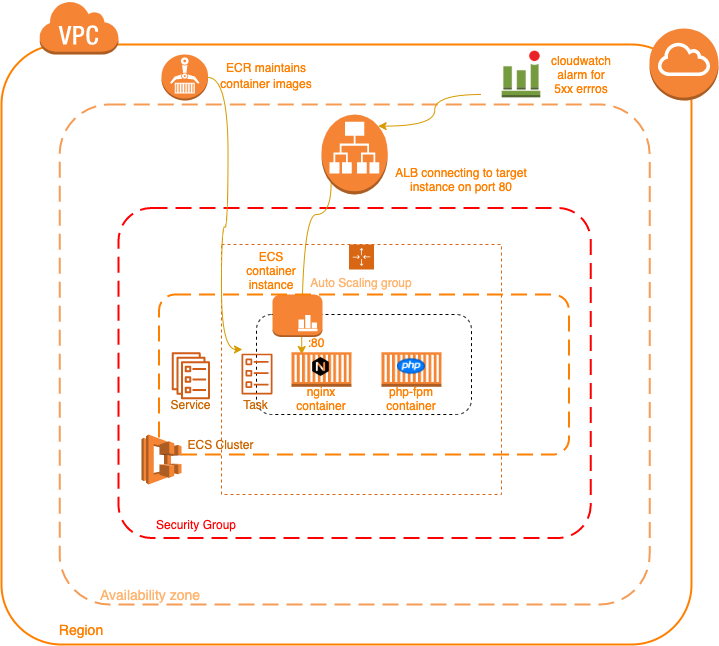
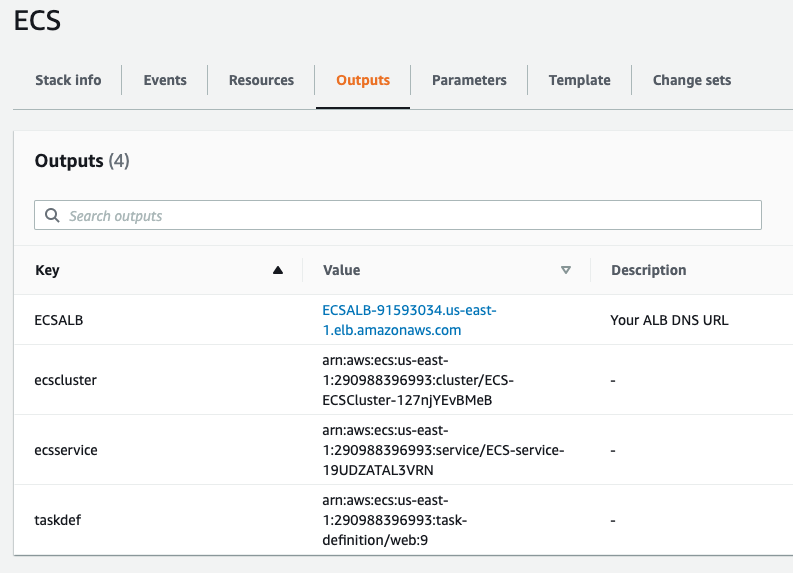
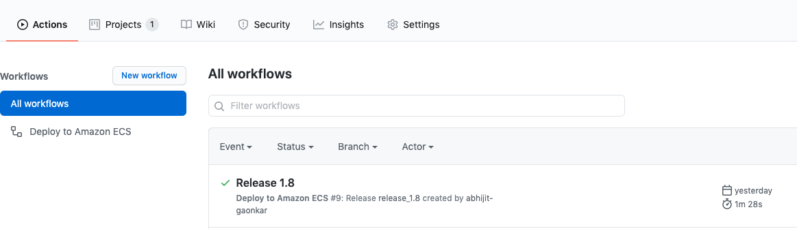
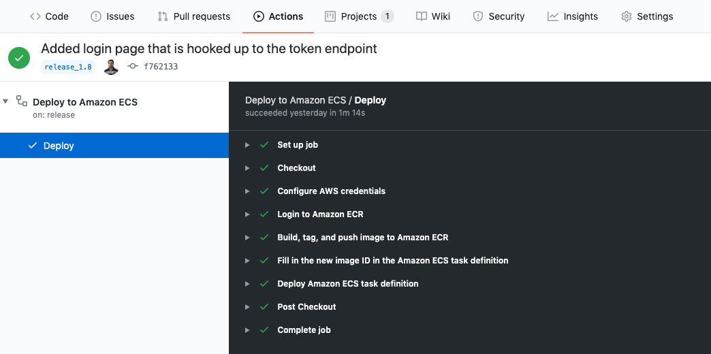
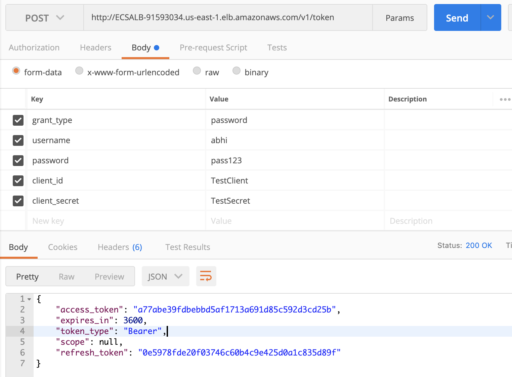
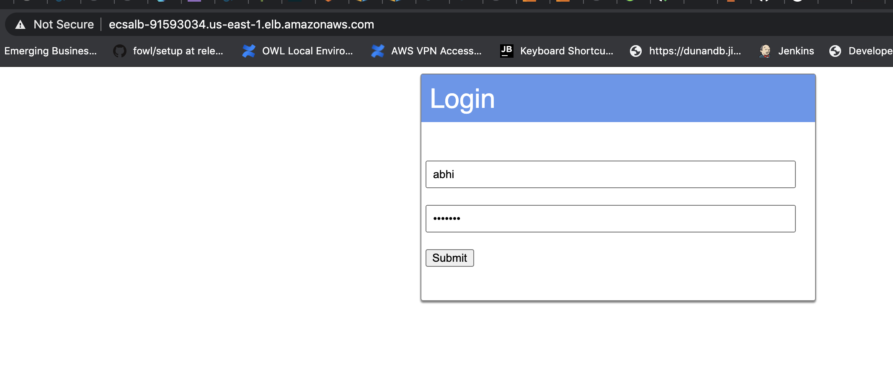

# Ambitious
Ambitious goal of rebuilding Amazon.com’s shopping experience as a set of microservices. 

This repo builds the **Auth** service which implements OAuth2 grant-type password.  
A login page is also set up which integrates with the Auth service. 
Application is written in PHP 7 using [Slim framework](http://www.slimframework.com/).

### Local Setup

After cloning the repo locally with `$ git clone` install dependencies with [Composer](https://getcomposer.org/doc/00-intro.md). 
`$ composer install`

#### Docker
The application can be setup locally with [Docker](https://www.docker.com/products/docker-desktop). 
Official nginx and php-fpm docker images are used to build the app. 

##### Build Base Image
`$ docker build -t php-basic-nginx:latest -f Docker/nginx/Dockerfile .` 
`$ docker build -t php-basic-php-fpm:latest -f Docker/php-fpm/Dockerfile .` 

##### Build the stack locally
`$ docker-compose up -d`  
*Note: docker-compose.yml is used for development only.*

Application will now be running on port 8080 
http://localhost:8080/status should return http status code 200

## Deploy Application to AWS

### Application Architecture in AWS

### Register Images in AWS ECR 

##### Docker Login in ECR 
`$ aws ecr get-login-password --region us-east-1 | docker login --username AWS --password-stdin [AWS_ACCOUNT_ID].dkr.ecr.us-east-1.amazonaws.com`

##### Register Images in ECR and push Images
`$ aws ecr create-repository --repository ambitious/php` 
`$ docker tag php-basic-php-fpm [AWS_ACCOUNT_ID].dkr.ecr.us-east-1.amazonaws.com/ambitious/php` 
`$ docker push [AWS_ACCOUNT_ID].dkr.ecr.us-west-1.amazonaws.com/ambitious/php`

`$ aws ecr create-repository --repository ambitious/nginx` 
`$ docker tag php-basic-nginx [AWS_ACCOUNT_ID].dkr.ecr.us-east-1.amazonaws.com/ambitious/nginx` 
`$ docker push [AWS_ACCOUNT_ID].dkr.ecr.us-west-1.amazonaws.com/ambitious/nginx`

### Create Stack
Create the stack by uploading the Cloudformation script [EcsStack.json](aws/EcsStack.json). 
You will be prompted for...  
* Name of an existing EC2 KeyPair to enable SSH access to the ECS instances
* VPC that allows instances to access the Internet
* 2 subnets in your selected VPC
* Number of instances to launch in your ECS cluster
* Maximum number of instances that can be launched in your ECS cluster
* EC2 instance type (ECS container instance)

Once the stack is deployed the Output will have following values 
* ECSALB: ALB DNS url  
* ecsclusster: ARN of ecs cluster
* ecsservice: ARN of ecs service
* taskdef: ARN of task-definition

The application **login page** and **Auth service**(v1/token) will now be accessible at ECSALB. 
'ecsclusster' & 'ecsservice' values will be needed to set up the CI/CD which is described in the next section

### CI/CD with Gihub Actions Workflow
Refer [aws.yml](.github/workflows/aws.yml) file for Workflow Definition.
Replace values for 'service' and 'cluster' with 'ecsclusster' and 'ecsservice' value from stack output. E.g. 
service: ECS-service-19UDZATAL3VRN
cluster: ECS-ECSCluster-127njYEvBMeB

The [workflow](https://github.com/abhijit-gaonkar/ambitious/actions) gets triggered when a release is created...

  

### The Application
The Auth service can be invoked by postman. See example below.

The login page integrates with Auth service.

To Test, use credentials `username: abhi password: pass123`

### CLI commmands
##### Create Cluster Task Definition
`$ aws ecs register-task-definition --cli-input-json file://web-task-definition.json`

##### Run Task
`$ aws ecs run-task --cluster [CLUSTER_NAME] --task-definition web --count 1`

##### Create Service
`$ aws ecs create-service --cluster [CLUSTER_SERVICE] --service-name web --task-definition  web --desired-count 1`
